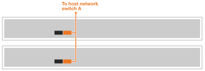

= Câblez vos serveurs tiers pour AI Data Engine
:allow-uri-read: 
:icons: font
:imagesdir: ../media/

[role="lead"]
Connectez vos serveurs tiers au réseau hôte et aux commutateurs du réseau du cluster pour activer le traitement des charges de travail d'IA et leur intégration avec votre système de stockage AFX 1K. Cette procédure utilise des connexions pour l'accès au réseau hôte et la communication avec le cluster, permettant ainsi aux nœuds d'exploiter l'infrastructure de cluster existante sans interrompre l'alimentation du système AFX 1K.

.À propos de cette tâche
Ces procédures présentent des configurations courantes. Le câblage spécifique dépend des composants compatibles avec votre système de stockage. Pour des informations de configuration complètes, consultez la documentation de votre serveur tiers.

.Avant de commencer
* Vous disposez déjà d'un système de stockage AFX 1K installé. Pour plus d'informations sur l'installation du système de stockage AFX 1K, consultez link:https://docs.netapp.com/us-en/ontap-afx/install-setup/install-setup-workflow.html["Documentation d'installation du système de stockage AFX 1K"^].
* Vous avez installé et configuré les commutateurs réseau requis. Contactez votre administrateur réseau pour obtenir des informations sur la connexion du système à vos commutateurs réseau.
* Vous avez pris connaissance des exigences de câblage de vos serveurs tiers. Pour des informations sur la configuration du câblage, consultez la documentation de vos serveurs tiers.

NOTE: Trois serveurs tiers sont nécessaires pour les déploiements du logiciel AI Data Engine software.

== Étape 1 : Connectez les serveurs tiers au réseau hôte

Pour les serveurs tiers, connectez-vous à votre réseau hôte.

.Étapes
. Connectez les ports réseau 'b' 100GbE des serveurs tiers au commutateur réseau de données Ethernet A en utilisant les câbles appropriés en fonction des cartes d'interface réseau (NIC) de votre serveur et des types de ports de commutateur.
+
Par exemple :

+
** Serveur tiers 1, port 'e4b'
** Serveur tiers 2, port 'e4b'
+
*Câbles 100GbE*

+
image::../media/oie_cable100_gbe_qsfp28.png[Câble Ethernet 100 Gb]

+

. Connectez les ports réseau 100GbE « b » des serveurs tiers au commutateur réseau de données Ethernet B à l’aide des câbles appropriés en fonction des cartes d’interface réseau (NIC) de votre serveur et des types de ports du commutateur. Par exemple :
+
** Serveur tiers 1, port 'e5b'
** Serveur tiers 2, port 'e5b'
+
*Câbles 100GbE*

+
image::../media/oie_cable100_gbe_qsfp28.png[Câble Ethernet 100 Gb]

+
image::../media/drw_aide_server_host_b_ieops-2832.svg[Câble vers réseau Ethernet]

NOTE: Veuillez vous référer à la documentation de votre serveur tiers pour connaître les configurations de ports et les types de câbles spécifiques.

== Étape 2 : Câbler les connexions du cluster

Pour les serveurs tiers, câblez les connexions du cluster.

.Étapes
. Connectez les ports réseau de cluster 'a' 100GbE des serveurs tiers au commutateur réseau de cluster A en utilisant les câbles appropriés en fonction des cartes d'interface réseau (NIC) et des types de ports de commutateur de votre serveur tiers.
+
Par exemple :

+
** Serveur tiers 1, port 'e4a'
** Serveur tiers 2, port 'e4a'
+
*Câbles 100GbE*

+
image::../media/oie_cable100_gbe_qsfp28.png[Câble Ethernet 100 Gb]

+
image::../media/drw_aide_server_cluster_a_ieops-2833.svg[Câble vers réseau Ethernet]

. Connectez les ports réseau de cluster 'a' 100GbE des serveurs tiers au commutateur réseau de cluster B à l'aide des câbles appropriés en fonction des cartes d'interface réseau (NIC) de votre serveur et des types de ports de commutateur.
+
Par exemple :

+
** Serveur tiers 1, port 'e5a'
** Serveur tiers 2, port 'e5a'
+
*Câbles 100GbE*

+
image::../media/oie_cable100_gbe_qsfp28.png[Câble Ethernet 100 Gb]

+
image::../media/drw_aide_server_cluster_cabling_b_ieops-2834.svg[Câble vers réseau Ethernet]

NOTE: Veuillez vous référer à la documentation de votre serveur tiers pour connaître les configurations de ports et les types de câbles spécifiques.

.Et ensuite ?
Une fois le matériel câblé, link:power-on-hardware.html["Mettez sous tension vos serveurs tiers"].
