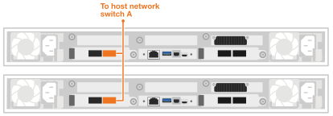

= Câblez vos Data Compute Node pour AI Data Engine
:allow-uri-read: 
:icons: font
:imagesdir: ../media/

[role="lead"]
Connectez vos nœuds de calcul aux commutateurs du réseau hôte et du réseau de cluster pour activer le traitement des charges de travail d’IA et l’intégration avec votre système de stockage AFX 1K. Cette procédure utilise des connexions 100GbE pour l’accès au réseau hôte et la communication au sein du cluster, permettant aux nœuds de tirer parti de l’infrastructure de cluster existante sans éteindre le système AFX.

.À propos de cette tâche
Ces procédures présentent des configurations courantes. Le câblage spécifique dépend des composants commandés pour votre système de stockage. Pour des détails complets sur la configuration et les priorités des emplacements, consultez link:https://hwu.netapp.com["NetApp Hardware Universe"^].

NOTE: Il n'est pas nécessaire de mettre hors tension le système de stockage AFX 1K lors du câblage des Data Compute Node. Vous pouvez ajouter les Data Compute Node à un système de stockage AFX 1K existant qui est déjà sous tension et configuré.

.Avant de commencer
* Vous disposez déjà d'un système de stockage AFX 1K installé. Pour plus d'informations sur l'installation du système de stockage AFX 1K, consultez link:https://docs.netapp.com/us-en/ontap-afx/install-setup/install-setup-workflow.html["Documentation d'installation du système de stockage AFX 1K"^].
* Vous avez installé et configuré les commutateurs réseau requis. Contactez votre administrateur réseau pour obtenir des informations sur la connexion du système à vos commutateurs réseau.
* Vous avez examiné le link:../install-setup/cable-overview.html["exigences de câblage pour les Data Compute Node"].

NOTE: Un minimum de trois nœuds de calcul de données est requis pour déployer AI Data Engine.

== Étape 1 : Connectez les Data Compute Node au réseau hôte

Vous pouvez connecter les ports du Data Compute Node à votre réseau hôte.

.Étapes
. Connectez le port e4b des Data Compute Node suivants au commutateur de réseau de données Ethernet A :
+
** Data Compute Node 1, port e4b
** Data Compute Node 2, port e4b
+
*Câbles 100GbE*

+
image::../media/oie_cable100_gbe_qsfp28.png[Câble Ethernet 100 Gb]

+

. Connectez le port e5b des Data Compute Node suivants au commutateur de réseau de données Ethernet B :
+
** Data Compute Node 1, port e5b
** Data Compute Node 2, port e5b
+
*Câbles 100GbE*

+
image::../media/oie_cable100_gbe_qsfp28.png[Câble Ethernet 100 Gb]

+
image::../media/drw_aide_network_cabling_b_ieops-2648.svg[Câble vers réseau Ethernet]

== Étape 2 : Câbler les connexions du cluster de Data Compute Node

Pour les nœuds de calcul de données, utilisez des câbles de dérivation 4x100GbE pour connecter les ports e4a/e5a pour les connexions du cluster.

.Étapes
. Connectez le port e4a des Data Compute Node suivants à un port non-ISL sur le commutateur réseau du cluster A :
+
** Data Compute Node 1, port e4a
** Data Compute Node 2, port e4a
+
*Câbles de dérivation 4x100GbE*

+
image::../media/oie_cable100_gbe_qsfp28.png[Câble Ethernet 100 Gb]

+
image::../media/drw_aide_switched_cluster_cabling_a_ieops-2649.svg[Câble vers réseau Ethernet]

. Connectez le port e5a des Data Compute Node suivants à un port non-ISL du commutateur réseau du cluster B :
+
** Data Compute Node 1, port e5a
** Data Compute Node 2, port e5a
+
*Câbles de dérivation 4x100GbE*

+
image::../media/oie_cable100_gbe_qsfp28.png[Câble Ethernet 100 Gb]

+
image::../media/drw_aide_switched_cluster_cabling_b_ieops-2650.svg[Câble vers réseau Ethernet]

.Et ensuite ?
Une fois le matériel câblé, link:power-on-hardware.html["Mettez sous tension vos Data Compute Node"].
